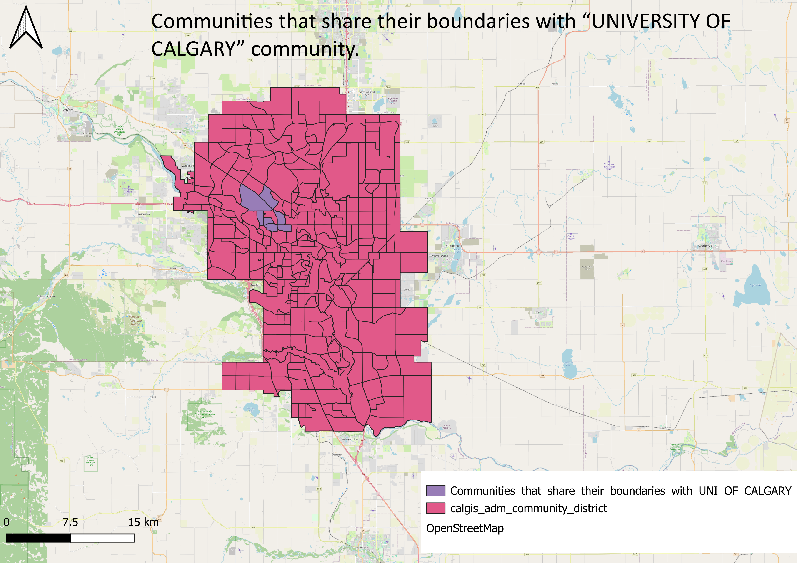
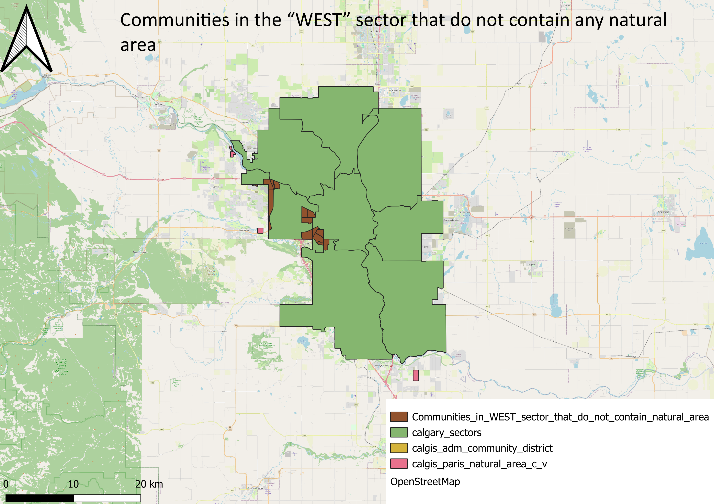
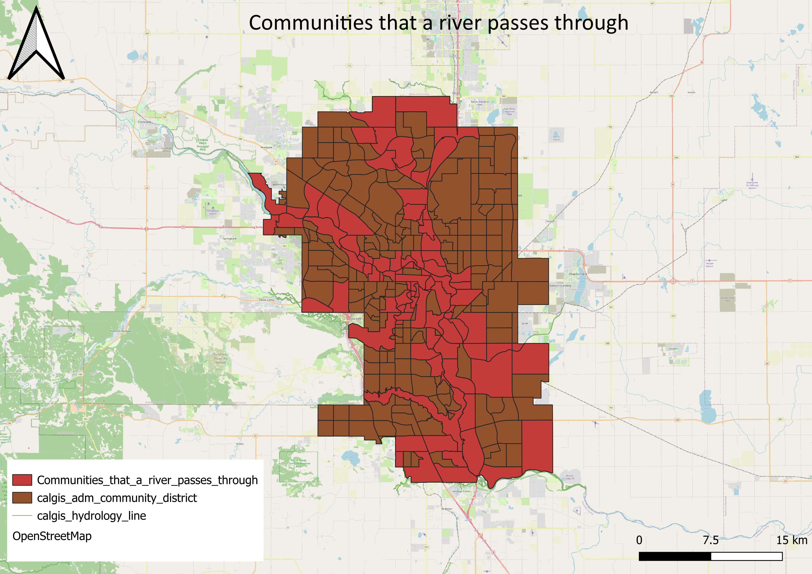
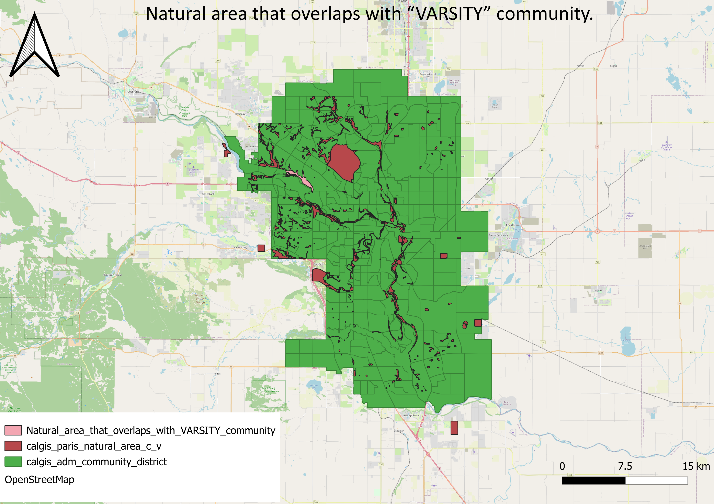

# Calgary Spatial Analysis — QGIS Projects

**Tool:** QGIS  
**Location:** Calgary, Alberta, Canada  
**Data Source:** City of Calgary Open Data Portal  

A series of spatial analysis operations performed on Calgary 
municipal open data. Each map answers a specific spatial question 
using geoprocessing tools including intersection, difference, 
boundary extraction, and spatial joins.

---

## About This Work

These maps were produced as part of a structured GIS analysis 
exercise focused on Calgary's urban geography. The datasets used 
include community district boundaries, sector boundaries, policy 
plan boundaries, hydrological networks, natural areas, and the 
street network. All analysis was performed in QGIS using the 
Alberta-specific coordinate system EPSG:3776 (NAD83 Alberta 3TM 
ref merid 114°W).

---

## Analysis 1 — Features in Policy Plan Boundaries Based on Status

**Geoprocessing tool:** Attribute query and spatial selection  
**Question:** Which features fall within Calgary's Policy Plan 
Boundaries, filtered by status?

This map displays all features within the Policy Plan Boundary 
dataset, classified by their approval status. It gives a city-wide 
view of the extent of active planning designations across Calgary.

**Skills demonstrated:**
- Attribute-based filtering
- Polygon layer visualisation
- City-wide extent mapping

---

## Analysis 2 — Intersection of SOUTH Sector with L.R.T. Policy Plan Type

**Geoprocessing tool:** Intersection  
**Question:** Where does the South sector of Calgary overlap with 
areas designated as L.R.T. (Light Rail Transit) policy plan type?

This map identifies areas in the South sector that fall within 
LRT policy plan designations, helping planners understand where 
transit-oriented planning overlaps with specific city sectors.

**Skills demonstrated:**
- Polygon intersection analysis
- Multi-layer overlay
- Sector-based spatial filtering

---

## Analysis 3 — Areas in NORTHEAST Sector Not in Area Structure Plan Type

**Geoprocessing tool:** Difference  
**Question:** Which parts of the Northeast sector are not covered 
by an Area Structure Plan?

Using the difference operation, this map highlights planning gaps 
within the Northeast sector — areas that fall outside any Area 
Structure Plan designation, which could indicate future planning 
priorities.

**Skills demonstrated:**
- Difference geoprocessing
- Planning gap identification
- Sector-specific analysis

---

## Analysis 4 — Common Boundary Between WEST and NORTHWEST Sectors

**Geoprocessing tool:** Shared boundary / Line extraction  
**Question:** What is the shared boundary line between the West 
and Northwest sectors of Calgary?

This map extracts and displays the exact shared boundary between 
two adjacent city sectors, useful for administrative boundary 
analysis and cross-sector planning coordination.

.png)

**Skills demonstrated:**
- Boundary extraction
- Line geometry analysis
- Adjacent polygon relationships

---

## Analysis 5 — Rivers That Intersect with GLENMORE Road

**Geoprocessing tool:** Intersection (line on line)  
**Question:** Which rivers in Calgary cross the Glenmore road 
corridor?

This map identifies hydrological features (rivers and streams) 
that cross the Glenmore Trail road corridor. This type of analysis 
is important for infrastructure planning, flood risk assessment 
and bridge location decisions.

**Skills demonstrated:**
- Line-on-line intersection
- Hydrological network analysis
- Road corridor analysis

---

## Analysis 6 — Communities Sharing Boundaries with University of Calgary

**Geoprocessing tool:** Adjacency / Select by location  
**Question:** Which communities in Calgary share a boundary with 
the University of Calgary community?

This map identifies all neighbouring communities directly adjacent 
to the University of Calgary community district. This type of 
adjacency analysis is used in neighbourhood planning, transit 
routing and service delivery.

**Skills demonstrated:**
- Adjacency analysis
- Select by location
- Community district relationships

---

## Analysis 7 — Communities in WEST Sector Without Natural Areas

**Geoprocessing tool:** Difference / Select by location  
**Question:** Which communities in the West sector contain no 
natural areas within their boundaries?

This map identifies communities in the West sector that have no 
designated natural area overlap, highlighting potential green 
space deficiencies that could inform parks planning decisions.

**Skills demonstrated:**
- Negative spatial selection (what is absent)
- Natural area overlay
- Green space gap analysis

---

## Analysis 8 — Communities That a River Passes Through

**Geoprocessing tool:** Select by location (intersect)  
**Question:** Which Calgary communities have a river passing 
through them?

This map identifies all community districts that contain or are 
crossed by a river or stream. This analysis has direct applications 
in flood risk planning, emergency management and environmental 
assessment.

**Skills demonstrated:**
- Polygon-line intersection
- Hydrological overlay
- Flood risk context mapping

---

## Analysis 9 — Natural Area Overlapping with VARSITY Community

**Geoprocessing tool:** Intersection / Clip  
**Question:** Which natural areas overlap with the Varsity 
community in Calgary?

This map identifies and extracts the portion of Calgary's natural 
area network that falls within the Varsity community boundary. 
It demonstrates precise polygon clipping for community-level 
environmental analysis.

**Skills demonstrated:**
- Polygon clipping
- Community-level environmental analysis
- Natural area inventory

---

## Tools and Techniques Used

| Technique | Applied In |
|---|---|
| Intersection | 2, 5, 8, 9 |
| Difference | 3, 7 |
| Boundary extraction | 4 |
| Attribute filtering | 1 |
| Select by location | 6, 7, 8 |
| Hydrological analysis | 5, 8 |
| Coordinate system: EPSG:3776 | All maps |

---

## Data Sources

- Calgary Community District Boundaries — City of Calgary Open Data
- Calgary Sector Boundaries — City of Calgary Open Data
- Policy Plan Boundaries — City of Calgary Open Data
- Hydrology Network — City of Calgary Open Data
- Natural Areas — City of Calgary Open Data
- Street Network — City of Calgary Open Data

All data sourced from: **https://data.calgary.ca**

---

## Related Projects

- [Access to Schools in Calgary](https://github.com/Folashade-Adewara/Calgary-School-Access-Analysis) — 500m buffer and walkability analysis
- [Full GIS Portfolio](https://github.com/Folashade-Adewara/GIS-Portfolio) — Complete portfolio overview

---

## Contact

🐙 GitHub: [Folashade-Adewara](https://github.com/Folashade-Adewara)  
💼 LinkedIn: Folashade Adewara
